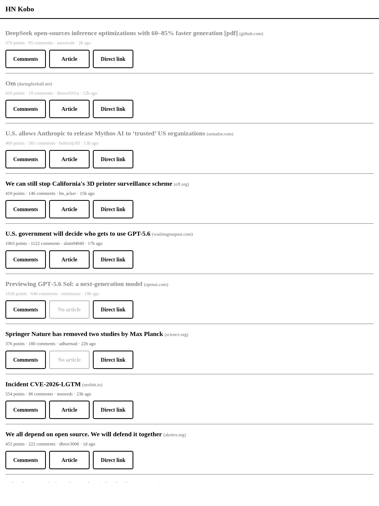
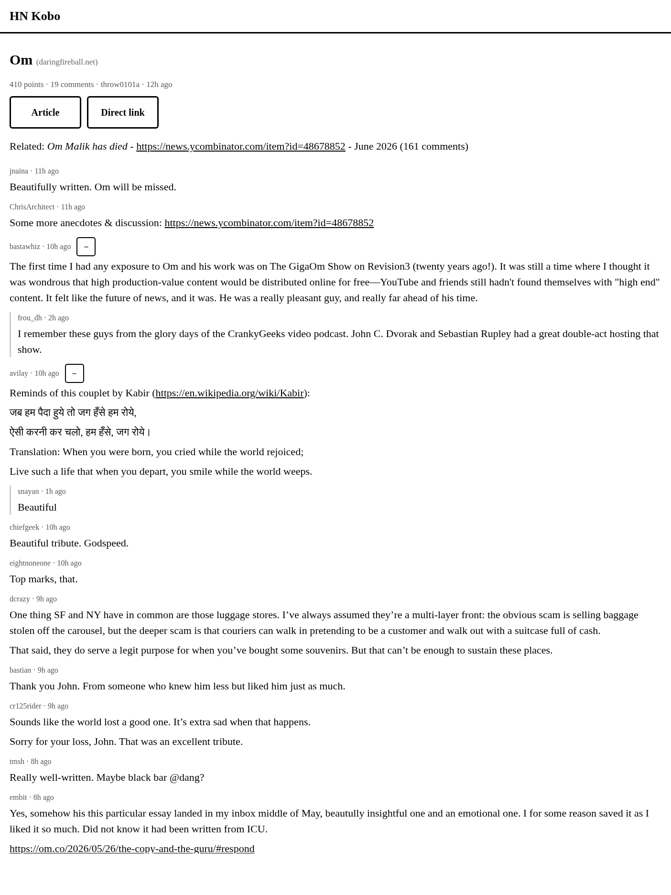

# HN Kobo

A tiny, plaintext-y **Hacker News reader built for e-readers** — specifically the
Kobo Elipsa 2e and its minimal experimental web browser. It scrapes the top HN
stories, caches their full comment trees and best-effort article text, and serves
fast, simple, full-width HTML with big tap targets that render quickly on e-ink.

| Front page | Comments |
|---|---|
|  |  |

## Why

The Kobo's browser is slow and has limited CSS/JS support. Loading real article
pages (ads, web fonts, heavy JS, paywalls) is painful on e-ink. HN Kobo does the
heavy lifting on a server you control and serves stripped-down pages that load fast
and are easy to read and tap on a big e-ink display.

## What it does

- **Scrapes hourly** from the [Algolia HN API](https://hn.algolia.com/api)
  (`search_by_date` + a `points>X` filter), newest first. One request per story
  pulls the entire nested comment tree, so a run is only ~30–40 requests.
- **Best-effort article extraction** with
  [Mozilla Readability](https://github.com/mozilla/readability). When a site can't
  be extracted (paywall, bot-block, PDF, JS-only), the story permanently falls back
  to a plain "Direct link" — no retries.
- **Three views**, all full-width with large buttons:
  - **`/`** — front page: every unique story from the last 7 days, sorted strictly
    newest-first (by HN post time, not HN's weighted ranking). Already-read stories
    are dimmed.
  - **`/item/:id`** — comments: an HN-style tree with the top level and first reply
    level expanded by default; deeper threads collapse behind a big tap toggle.
  - **`/article/:id`** — the extracted article (title + body, images hotlinked).
- **Retention**: stories are kept for 7 days, then purged. Article bodies are scraped
  once and kept; comments are re-cached every run for the currently-trending stories.
- **Read state** is tracked server-side (single-user design — no login).

## Built for local LAN use

By default this binds to your LAN with **plain HTTP and no authentication**, because
it's intended to run on a machine on your home network that your Kobo can reach. Point
the Kobo browser at `http://<server-LAN-IP>:8089/` and you're done.

> ⚠️ **Repurposing for public use.** The app itself is just an Express server, so you
> *can* put it on the public internet — but it ships with **no auth and no HTTPS**. If
> you expose it publicly you should add, at minimum:
> - a reverse proxy (nginx/Caddy) terminating **HTTPS**,
> - some form of **authentication** (basic auth, an access token, or an SSO proxy),
> - and consider that the scraper hits the Algolia API from your server's IP.
>
> Nothing in the code prevents public hosting; it simply isn't hardened for it.

## Stack

Node.js + Express, server-rendered HTML, SQLite (`better-sqlite3`), no client
framework. A single ~20-line JS file powers comment expand/collapse.

## Configuration

Copy `.env.example` to `.env` and adjust:

| Variable | Default | Meaning |
|----------|---------|---------|
| `POINTS_THRESHOLD` | `300` | the `points>X` filter for the story list |
| `STORY_LIMIT` | `40` | how many of the newest above-threshold stories to process per run |
| `SCRAPE_INTERVAL_MS` | `3600000` | scrape cadence in ms (default hourly) |
| `RETENTION_DAYS` | `7` | purge stories older than this many days |
| `PORT` | `8089` | HTTP port |
| `HOST` | `0.0.0.0` | bind address (LAN-wide by default; use `127.0.0.1` to restrict) |
| `DB_PATH` | `data/hnkobo.db` | SQLite file (relative paths are resolved from the project root) |
| `ARTICLE_TIMEOUT_MS` | `15000` | per-article fetch timeout |
| `ARTICLE_CONCURRENCY` | `4` | max concurrent article fetches |
| `SCRAPE_ON_START` | `true` | run a scrape immediately on startup |

## Quick start

```bash
npm install
cp .env.example .env      # tweak if you like
npm run scrape            # optional: run a one-off scrape to populate the DB
npm start                 # starts the server; also scrapes on start + hourly
```

Then open `http://<this-machine-LAN-IP>:8089/` in the Kobo browser.

## Run as a service (systemd, user scope)

A unit file is included at [`hnkobo.service`](hnkobo.service). Install it under your
user systemd (no root required):

```bash
cp hnkobo.service ~/.config/systemd/user/hnkobo.service
# edit WorkingDirectory / ExecStart paths if your checkout differs

systemctl --user daemon-reload
systemctl --user enable --now hnkobo.service
loginctl enable-linger "$USER"      # keep it running after logout / across reboots

systemctl --user status hnkobo.service
journalctl --user -u hnkobo.service -f
```

## HTTP endpoints

| Method | Path | Description |
|--------|------|-------------|
| `GET` | `/` | front page (all cached stories, newest first) |
| `GET` | `/item/:id` | comments for a story |
| `GET` | `/article/:id` | extracted article (or direct-link fallback) |
| `POST` | `/scrape` | trigger a scrape manually |
| `GET` | `/healthz` | health check |

## Project layout

```
src/
  config.js     env/config loading
  db.js         SQLite schema + connection
  algolia.js    Algolia HN API client (story list + comment trees)
  extractor.js  Readability-based article extraction
  scraper.js    orchestration: fetch, cache, extract, purge
  server.js     Express app, routes, scheduler
  render.js     HTML helpers (escaping, layout, time-ago)
  scrape-once.js  one-off scrape entrypoint
public/
  style.css     minimal e-ink-friendly styles
  app.js        comment expand/collapse toggle
```

See [`VISION.md`](VISION.md) for the original goals and
[`DECISIONS_BEFORE_BUILD.md`](DECISIONS_BEFORE_BUILD.md) for the design decisions, and
[`FOLLOWUP.md`](FOLLOWUP.md) for known limitations and future ideas.

## License

MIT
